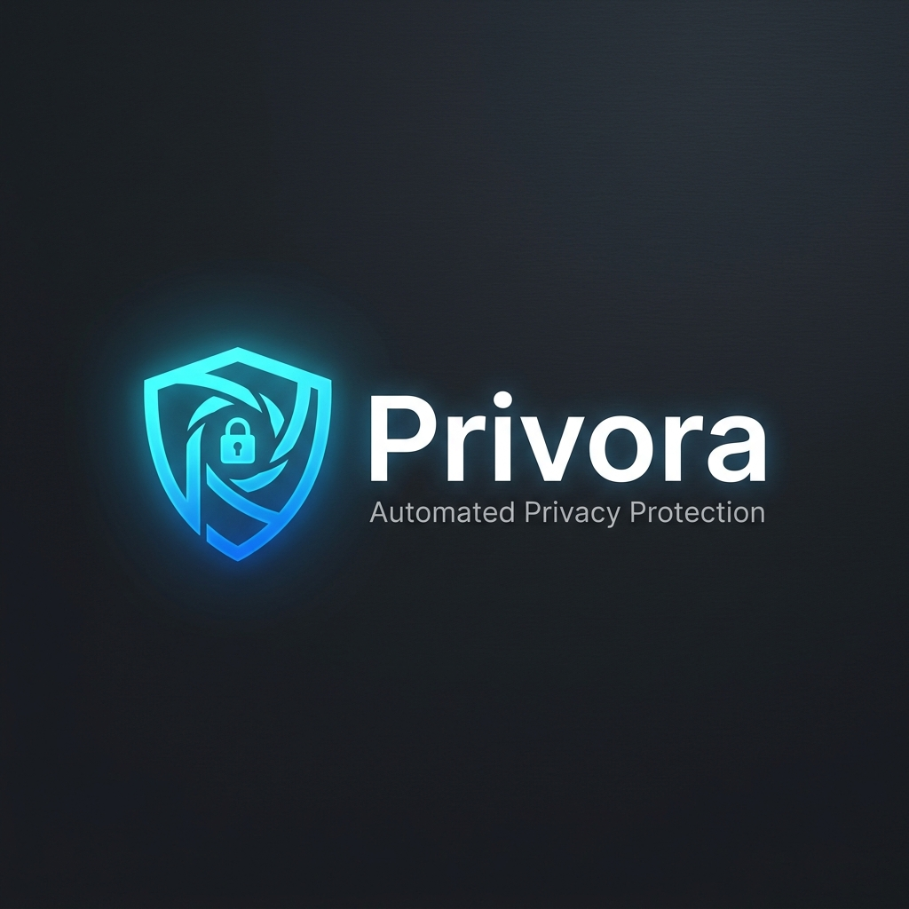
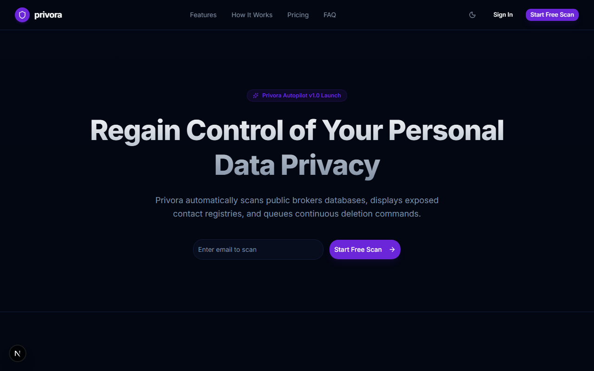
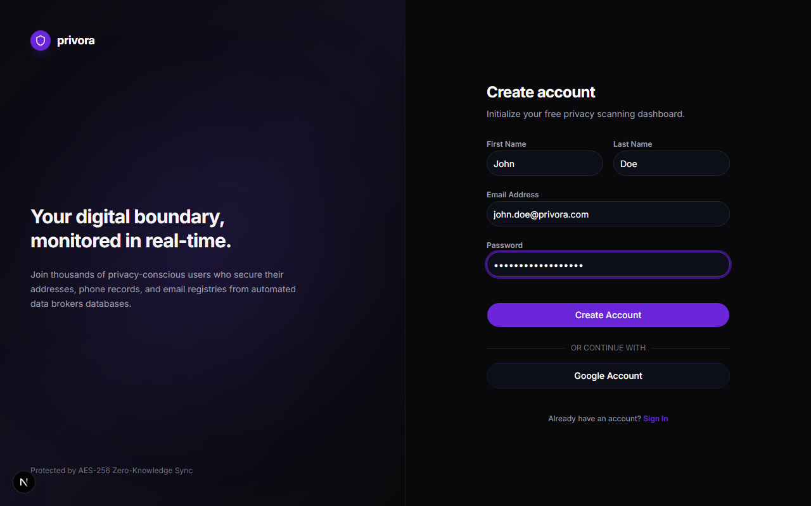
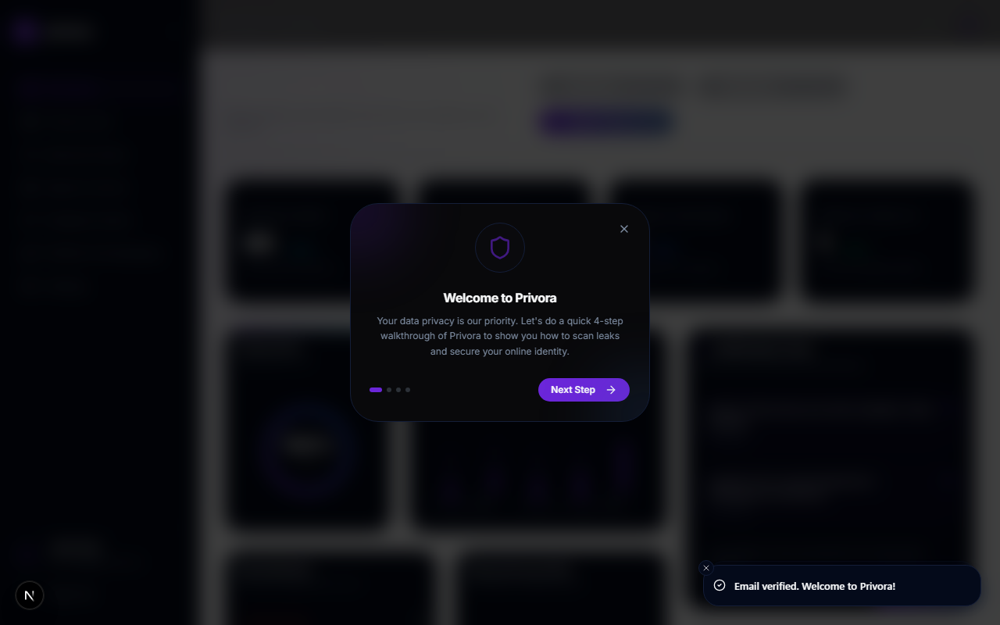
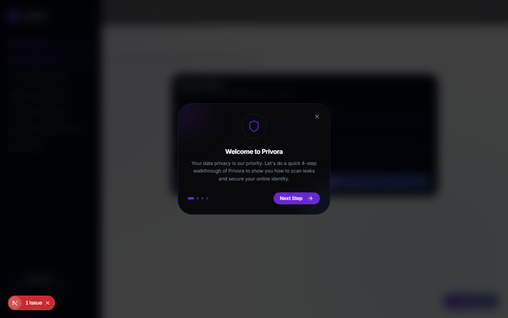
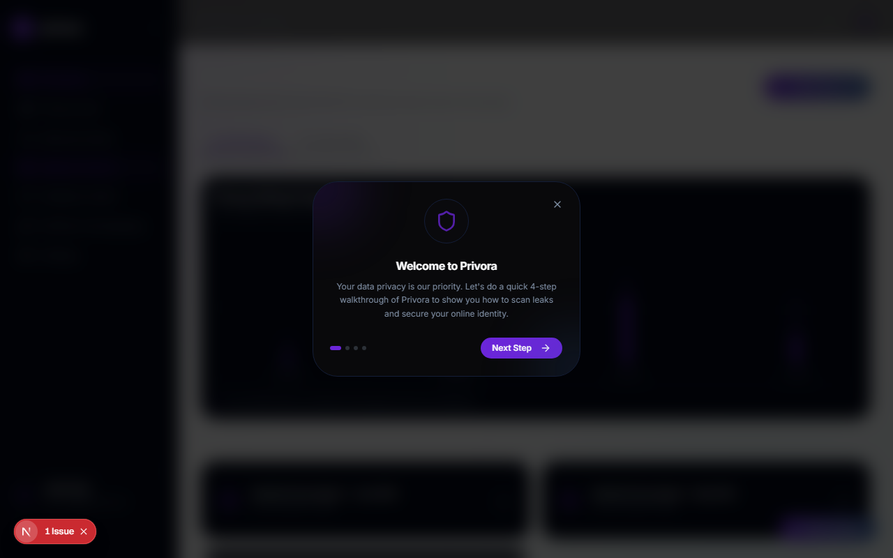
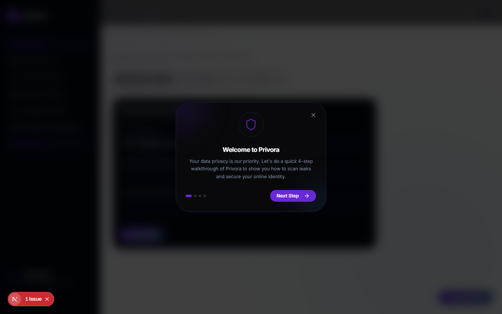

<p align="center">
  
</p>

<h1 align="center">Privora</h1>

<p align="center">
  <strong>Automated Zero-Knowledge Digital Footprint Protection Autopilot</strong>
</p>

<p align="center">
  <a href="https://privora-nu.vercel.app"><strong>🌐 Live Demo (Vercel)</strong></a> |
  <a href="#key-features">✨ Features</a> |
  <a href="#tech-stack">📦 Tech Stack</a> |
  <a href="#installation">⚙️ Installation</a> |
  <a href="#roadmap">🗺️ Roadmap</a>
</p>

<hr />

Privora is a premium, state-of-the-art privacy application designed to search and remove your personal identifiable information (PII) from public databases and data brokers. Equipped with zero-knowledge hashing protocols, Privora automates legal opt-out requests (CCPA, GDPR, HIPAA) to 80+ broker registries in the background, safeguarding your home addresses, phone numbers, email logs, and familial ties.

---

## 📷 Screenshots

### 1. Landing Page
Modern, highly responsive landing page showcasing the scanner interface and product value proposition.


### 2. Authentication Flow
Secure signup and verification flow equipped with local mock auth fallback for seamless testing.


### 3. Autopilot Dashboard
Central overview displaying your overall privacy rating, live broker scans, in-flight removals, and completed deletions.


### 4. Deep Scan Engine
Allows users to input profile parameters, run deep scans, and visualize exposure levels and broker details.


### 5. PDF Privacy Reports
Lists exportable privacy reports tracking active removal metrics, scan histories, and overall security progress.


### 6. Boundary Settings
Granular controls to toggle Autopilot sweeps, manage search profile hashes, set scan frequencies, and configure email alerts.


---

## ✨ Key Features

*   **Deep Exposure Scanning**: Instantly cross-reference profile data (addresses, emails, phone numbers) against major directories (Whitepages, Spokeo, Radaris).
*   **Zero-Knowledge Hash**: Search parameters are processed in-memory and hashed. No plain-text search targets are written to logs.
*   **Automated Opt-Out Requests**: Automatic generation and queueing of official opt-out requests to data brokers under CCPA and GDPR regulations.
*   **Privacy Score Gauge**: A dynamic, interactive score loader visualizes your exposure levels and calculates security ratings.
*   **Exportable Reports**: Generates professional PDF privacy reports containing summary statistics and active logs.
*   **Autopilot Scheduler**: Set scanning and opt-out frequencies (weekly, monthly, quarterly) to run in the background.

---

## 📦 Tech Stack

### Frontend & Core
*   **Framework**: [Next.js 16.2 (Turbopack)](https://nextjs.org/) & [React 19](https://react.dev/)
*   **Styling**: [Tailwind CSS v4](https://tailwindcss.com/)
*   **Animations**: [Framer Motion 12](https://www.framer.com/motion/)
*   **Icons**: [Lucide React](https://lucide.dev/)

### Backend & Integrations
*   **Database**: [Supabase](https://supabase.com/) (PostgreSQL client integration)
*   **Authentication**: [Clerk](https://clerk.com/) (Headless authentication with local mock fallback engine)
*   **Email Deliverability**: [Resend API](https://resend.com/)
*   **Analytics & Monitoring**: [PostHog](https://posthog.com/) & [Sentry](https://sentry.io/)

---

## ⚙️ Installation

### Prerequisites
*   Node.js (v18.x or later)
*   npm or yarn

### Setup Steps
1.  **Clone the Repository**:
    ```bash
    git clone https://github.com/ashwakshaik/Privora.git
    cd Privora
    ```

2.  **Install Dependencies**:
    ```bash
    npm install
    ```

3.  **Environment Setup**:
    Copy the example environment file and fill in your credentials:
    ```bash
    cp .env.example .env.local
    ```
    *Note: If Clerk keys are missing or left blank, the application automatically triggers **Mock Mode**, allowing complete local signup, login (OTP: `123456`), and database scanning via LocalStorage.*

4.  **Run Development Server**:
    ```bash
    npm run dev
    ```
    Open [http://localhost:3000](http://localhost:3000) in your browser.

5.  **Build Production Bundle**:
    ```bash
    npm run build
    npm start
    ```

---

## 📂 Folder Structure

```
Privora/
├── public/                  # Static assets (logos, icons, screenshots)
├── scripts/                 # Utility scripts (automation, capture tools)
├── src/
│   ├── app/                 # Next.js App Router (Layouts and Pages)
│   │   ├── (auth)/          # Authentication paths (signin, signup, verify)
│   │   ├── api/             # API webhooks and endpoints
│   │   ├── dashboard/       # Dashboard routes (scan, removal, reports, settings)
│   │   └── page.tsx         # Landing page entrypoint
│   ├── components/          # Reusable React components & UI widgets
│   ├── constants/           # Global constants and strings
│   ├── features/            # Feature-specific logic modules
│   ├── hooks/               # Custom React hooks
│   ├── lib/                 # DB connectors, schemas (Zod), and third-party APIs
│   ├── providers/           # Context providers (Auth, Theme)
│   └── styles/              # Global CSS stylesheets
├── .env.example             # Template for required environment variables
├── next.config.ts           # Next.js configuration
├── package.json             # NPM dependencies and project scripts
└── tsconfig.json            # TypeScript configuration
```

---

## 🗺️ Roadmap

### Phase 1 (v1.0.0) — Core Platform [Current]
- [x] Zero-knowledge mock-authentication & verification setup.
- [x] Scanning integration with Supabase local database fallback.
- [x] Interactive Privacy Score gauge.
- [x] Removal requests scheduler and tracking logs.
- [x] Settings, PDF Reports export, and interactive dashboard UI.

### Phase 2 (v1.1.0) — Automation & Integrations
- [ ] Connect live Clerk middleware and active Supabase hosting tables.
- [ ] Setup scheduled Cron automation for 80+ broker directories.
- [ ] Add SMS integration for instant data exposure alerts.

### Phase 3 (v2.0.0) — Mobile Ecosystem
- [ ] Launch cross-platform native iOS & Android applications.
- [ ] Implement real-time breach notifications.

---

## 📄 License
This project is licensed under the MIT License - see the [LICENSE](LICENSE) file for details.

---

## ✉️ Contact
**Ashwak Shaik** — Project Owner
*   GitHub: [@ashwakshaik](https://github.com/ashwakshaik)
*   Email: [ashwakshaik@example.com](mailto:ashwakshaik@example.com)
*   Project Target URL: [https://privora-nu.vercel.app](https://privora-nu.vercel.app)
