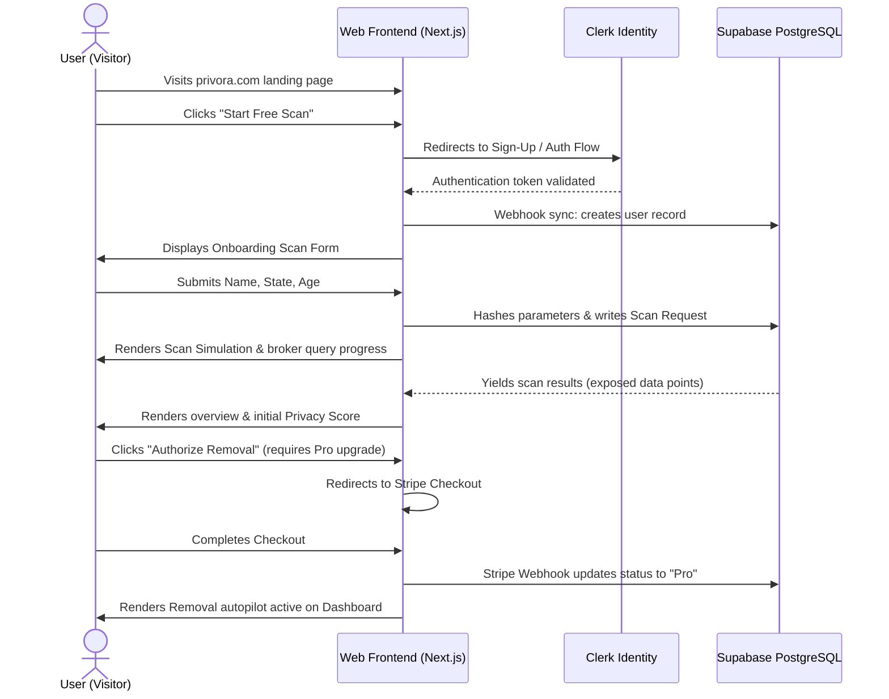

# Information Architecture (IA) — Privora

## 1. Complete Navigation Map
Privora is structured to separate the public-facing promotional product pages from the high-security dashboard application context.

```text
privora.com/
├── (Public Sandbox)
│   ├── /                          # Main Landing Page (Conversion Engine)
│   ├── /pricing                   # Plan Comparisons
│   ├── /privacy                   # Privacy & Data Processing Agreement
│   └── /terms                     # Terms of Service
├── (Auth Portal)
│   ├── /sign-in                   # User Login (Clerk UI / Headless Hooks)
│   ├── /sign-up                   # Account Creation (Clerk UI / Headless Hooks)
│   ├── /forgot-password           # Password Recovery Sequence
│   └── /verify-email              # OTP Verification Step
└── /dashboard (Protected Area)
    ├── /                          # Overview / Command Center (High-level Status)
    ├── /scan                      # Trigger & View Privacy Scans
    ├── /removal                   # Removal Request Tracker & Autopilot Center
    ├── /reports                   # Downloadable PDF monthly summaries
    └── /settings                  # Profile & General Controls
        ├── #profile               # Scan criteria, name, contact
        ├── #billing               # Stripe billing portal link & subscription plans
        └── #notifications         # Alert thresholds and email options
```

---

## 2. Public Pages
Designed for high speed, conversion, and clarity:
*   **Landing Page (`/`)**: Main marketing page. Features value statement, animated data broker scan simulator, live statistics counter (e.g., total records removed to date), feature grids, and dual CTA (Header + Hero) leading to `/sign-up`.
*   **Pricing Page (`/pricing`)**: Simple, clean toggle comparing the "Free tier" (Scan and manual opt-out instructions) against the "Pro tier" (Continuous scanning, automatic removal requests, monthly PDF reports).
*   **Legal Docs (`/privacy`, `/terms`)**: Standard typography-focused markdown renders detailing data collection, encryption processes, and the limited scope of our power of attorney (for requesting broker opt-outs).

---

## 3. Protected Pages (Dashboard App Context)
All routes nested under `/dashboard` are protected by Clerk Middleware.
*   **Overview (`/dashboard`)**: The main command center. Displays:
    *   Dynamic gauge displaying the Privacy Score.
    *   Aggregate counters: Total Brokers Scanned, Active Exposures, Removals Completed, In-Progress requests.
    *   Action button: "Run Dynamic Scan".
    *   Recent Alert Log (New broker exposures).
*   **Scan Control (`/dashboard/scan`)**:
    *   Search criteria inputs (Name, State, City, Estimated Age).
    *   Interactive scanning animation tracking progress across 80+ data brokers.
    *   Result table displaying Broker Name, Severity (High/Medium), Exposed Record Preview (masked phone/address), and "Request Removal" action CTA.
*   **Removal Center (`/dashboard/removal`)**:
    *   Autopilot toggle (Enable automated opt-outs).
    *   List of data brokers grouped by status: Active Exposures (`Exposed`), In-Progress (`Opt-out Sent`), Completed (`Removed`).
    *   Detailed status drawer detailing steps taken (e.g., "Opt-out fax sent", "Waiting for broker validation").
*   **Reports (`/dashboard/reports`)**:
    *   Historical progress graph (Privacy Score over time).
    *   List of monthly compliance report PDFs available for download.
*   **Settings (`/dashboard/settings`)**:
    *   **Profile Tab**: Add/edit scan criteria variants (alternative emails, previous home addresses to check).
    *   **Billing Tab**: Displays active tier (Free/Pro), Stripe Customer Portal trigger, billing history.
    *   **Notifications Tab**: Toggle checkboxes for "New Exposure Alerts", "Weekly Summary Emails", and "Removal Success Alerts".

---

## 4. Header & Footer Structures

### 4.1 Public Header
*   **Left Section**: Privora Brand Wordmark + Logo Icon.
*   **Middle Section (Desktop Links)**: Features, Pricing, Security Philosophy.
*   **Right Section**:
    *   "Sign In" text link.
    *   "Start Free Scan" call-to-action button (vibrant, modern primary contrast styling).

### 4.2 Public Footer
*   **Column 1**: Brand description, copyright notice, security certification badges.
*   **Column 2 (Product)**: Features, Pricing, Roadmap.
*   **Column 3 (Security)**: Zero-knowledge claims, Data retention policies, Opt-out legal scope.
*   **Column 4 (Company & Legal)**: Privacy Policy, Terms of Service, Contact Support.

### 4.3 Dashboard Sidebar (App Shell Navigation)
*   **Top**: Mini Brand Icon + Workspace dropdown selector.
*   **Main Navigation Items**:
    *   `Overview` (Icon: Home)
    *   `Privacy Scan` (Icon: Radar)
    *   `Removal Center` (Icon: ShieldAlert)
    *   `Reports` (Icon: FileText)
    *   `Settings` (Icon: Settings)
*   **Bottom**:
    *   User Profile Card (Avatar image, display name, subscription status badge).
    *   "Sign Out" trigger action button.

---

## 5. Primary User Flow Diagram


