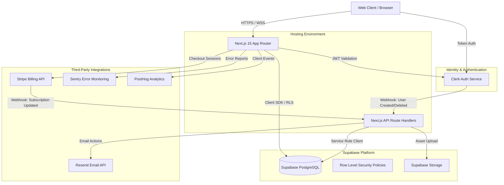
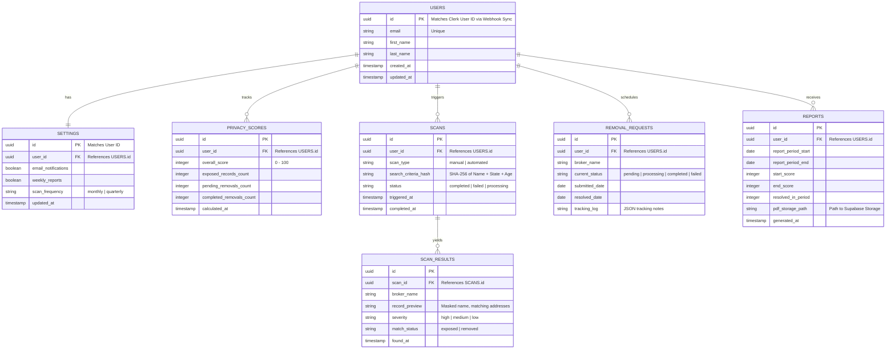

# System Architecture Document (SAD) — Privora

## 1. High-Level Architecture
Privora is structured as a modern, decoupled web application. The frontend is built on **Next.js 15 (App Router)** and hosted on **Vercel**. Authentication is delegated to **Clerk** (using JWT integration for authorization). The backend utilizes **Supabase** for database management, file storage, and serverless edge functions. Stripe handles transaction billing, Resend handles transactional email delivery, and monitoring/analytics are routed via PostHog and Sentry.



---

## 2. Frontend Architecture
The frontend is built on the React 19 / Next.js 15 App Router standard:
*   **Routing**: File-system based App Router. Pages are Server Components by default to maximize SEO performance and minimize client-side bundle sizes. Interactive elements use React 19 Client Components (`"use client"`).
*   **State Management**: React Context for light global state (e.g., active active sidebar tab, theme context). Server state is fetched/validated via Next.js server actions and caching hooks.
*   **Styling**: Tailwind CSS utilizing css variables aligned with shadcn/ui component tokens. Supports seamless dark/light mode switches.
*   **Component Design**: Atomic design principles with components managed via `src/components/ui/` (base components) and `src/components/shared/` (composite components).

---

## 3. Backend & Database Architecture (Supabase)
Supabase manages PostgreSQL storage. We leverage Row Level Security (RLS) to enforce data boundaries directly at the database layer.

### 3.1 PostgreSQL Database Schema



---

## 4. Authentication Flow (Clerk + Supabase Integration)
To provide a secure, buttery-smooth authentication experience, we integrate Clerk's authentication hooks with Supabase RLS.

1.  **Sign-Up Flow**:
    *   User signs up on the frontend via Clerk's custom `<SignUp />` flow.
    *   Clerk issues a `user.created` webhook event.
    *   Next.js API route (`src/app/api/webhooks/clerk/route.ts`) verifies the signature and inserts a matching record into Supabase's `users` table.
2.  **JWT Verification for API/Database Requests**:
    *   The frontend client requests a Clerk JWT token.
    *   The Supabase client is initialized using this JWT as the Bearer token.
    *   Supabase extracts the User ID using standard claims and executes RLS verification checks.
3.  **Row Level Security (RLS) Implementation**:
    *   All tables (except public-facing ones) have RLS enabled.
    *   RLS Policy example:
        ```sql
        CREATE POLICY "Allow individual read access" ON public.scans
        FOR SELECT TO authenticated
        USING (auth.uid() = user_id);
        ```

---

## 5. Storage Strategy
Supabase Storage is utilized to host generated artifacts such as PDF privacy reports.
*   **Bucket**: `privacy-reports` (Private bucket).
*   **Security**: RLS policy ensures users can only read files matching their `user_id` folder structure:
    `privacy-reports/{user_id}/{report_id}.pdf`
*   **Retention**: Temporary signed URLs are generated by Next.js Server Components to allow downloads, expiring after 15 minutes.

---

## 6. Directory Layout
Consistent with project guidelines, the layout is organized as follows:

```text
Privora/
├── .github/
│   └── workflows/
│       ├── test.yml            # CI: Runs Lints, Typescheck, and Unit Tests
│       └── deploy.yml          # CD: Builds verification branch
├── docs/
│   ├── PDD.md
│   ├── SAD.md
│   ├── IA.md
│   ├── UI_UX_Blueprint.md
│   ├── FRS.md
│   ├── Design_System.md
│   ├── UI_Design_Plan.md
│   ├── Component_Library.md
│   ├── Motion_Design.md
│   └── Development_Blueprint.md
├── public/
│   ├── fonts/
│   ├── icons/
│   └── brand/                  # Logo variations
├── src/
│   ├── app/                    # Next.js App Router root
│   │   ├── (auth)/             # Login, Register, Forgot Password
│   │   ├── (dashboard)/        # Main application dashboard layouts & pages
│   │   ├── api/                # Webhooks and backend integrations
│   │   └── page.tsx            # Public landing page
│   ├── components/
│   │   ├── ui/                 # shadcn core atomic components
│   │   └── shared/             # Composite headers, sidebars, forms
│   ├── hooks/                  # Custom react hooks
│   ├── lib/                    # Supabase Client, stripe helper, utility code
│   └── styles/
│       └── globals.css         # Tailwind directives & CSS variables
├── supabase/
│   ├── migrations/             # SQL schema files
│   └── config.toml             # Local emulation settings
├── package.json
└── README.md
```

---

## 7. Security Architecture
*   **Zero-Knowledge Search Intent**: To prevent logging PII, search inputs are processed in-memory. The actual inputs are hashed using SHA-256 before scanning broker lists to avoid writing plain-text search terms to general application server logs.
*   **PII Encryption**: Sensitive database attributes (such as user address profiles used in opt-out automation) are encrypted before insertion into Supabase PostgreSQL using `pgcrypto` AES-256 keys, ensuring databases are secure even in the event of a raw dump leak.
*   **Authentication & Session Management**: Delegated completely to Clerk. Sessions utilize HTTP-Only cookies with Lax/Strict configuration to prevent CSRF and XSS tokens leakage.

---

## 8. Integrations
1.  **Resend**: Handles all transactional email flows (e.g. registration welcome messages, monthly PDF reports alerts, and removal updates).
2.  **Stripe**: Connects to customer records. Subscriptions determine access levels (e.g., Free Scan-only vs. Paid Automated Removals).
3.  **PostHog**: Tracks custom events (e.g., "Scan Initiated", "Opt-out Authorized") without sending PII.
4.  **Sentry**: Catches client-side React rendering failures and server-side route errors.

---

## 9. Future Expansion Strategy
*   **Broker Worker Microservices**: Standard HTTP calls currently invoke Supabase edge functions. For future releases requiring high-volume opt-out selenium scripts, we will migrate request processing to an AWS SQS queue backed by Node/Python workers executing headless scraping scripts.
*   **LLM Processing Integration**: To integrate MYRAH (AI Assistant) in version 2, we will enable pgvector inside Supabase PostgreSQL, enabling semantic lookup vectors matching opt-out legal documents.
