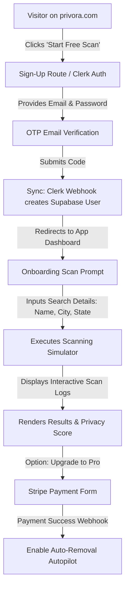
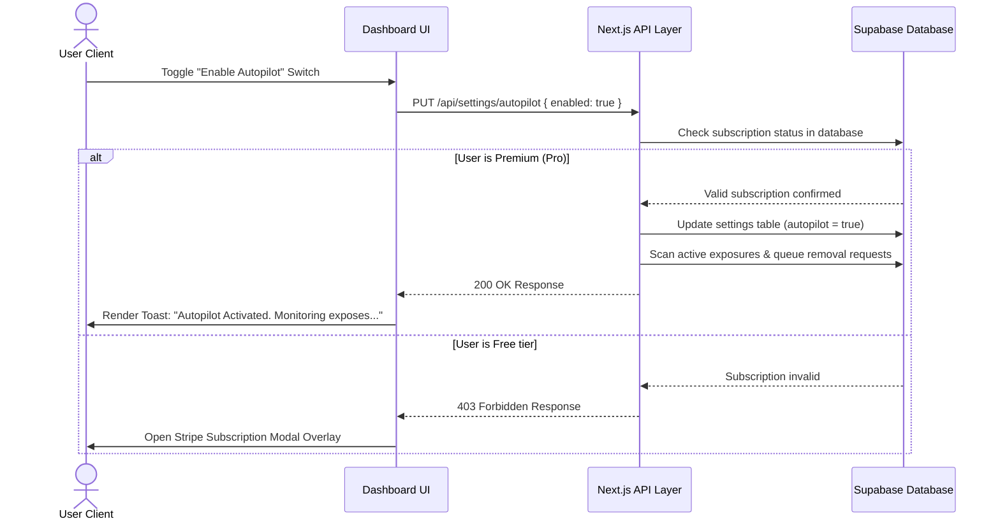

# Complete User Experience (UX) Flows — Privora (Day 3)

This document maps user interaction flows, data validation checks, error redirects, empty states, and success notifications for all user paths.

---

## 1. Onboarding & Initial Scan User Journey

---

## 2. On-Demand Privacy Scan Flow
*   **Trigger**: User clicks "New Scan" from Sidebar or Dashboard Header.
*   **Step 1: Input Check**: User fills in fields (First Name, Last Name, State, City, Age Range). Form validation executes:
    *   *Pass*: Proceed to Step 2.
    *   *Fail*: Stop execution, highlight target field input, and focus first invalid input field.
*   **Step 2: Processing Simulator**: Page switches to execution layout. An interactive terminal output renders running status calls while the percentage bar increments.
*   **Step 3: Database Writes**: Backend queries finish and compile. Results are encrypted and written to `scan_results` database table, updating the user's overall `privacy_score` in Supabase.
*   **Step 4: Output Rendering**: Simulator slides out; results table fades in. Individual results display inline buttons to queue removals.

---

## 3. Removal & Autopilot Center Flow

---

## 4. Reports Retrieval Flow
*   **Generation Trigger**: Dynamic database cron runs at midnight on the 1st of every month, generating a PDF summary from the user's weekly scans.
*   **Storage Upload**: PDF is written to Supabase private storage folder: `privacy-reports/{user_id}/{report_id}.pdf`.
*   **Notification**: Resend API dispatches transactional email: "Your monthly privacy report is ready."
*   **Retrieval (UI Action)**:
    1.  User visits `/dashboard/reports`.
    2.  User clicks "Download Report".
    3.  Client triggers server action to request secure 15-minute signed Supabase URL.
    4.  Client downloads PDF locally.

---

## 5. UI Feedback States

### 5.1 Empty States
We enforce empty layout standards across all modules to prevent plain blank screens:
*   **Dashboard (New User)**: Shows a shield logo illustration, sub-header: "No scan data available. Start by scanning your personal details to identify online exposures", and a prominent violet "Initiate Privacy Scan" action button.
*   **Scan Page (No Results)**: Displays green check icon, text: "No exposure records found. Your digital footprint is clean!", and a button pointing back to Dashboard.
*   **Reports Archive (New User)**: Displays a file graphic layout, text: "Your historical trend chart and downloadable PDF reports will appear here after your first monthly scan cycles complete."

### 5.2 Success Confirmation Loops
*   **Settings Saved**: Toast notification fades in from bottom-right (`"Settings updated successfully."`, duration `3000ms`, backdrop blur borders).
*   **Removal Completed**: Broker row status badge swaps from warning amber `In Progress` to green `Removed` with a scaling animation.

### 5.3 Error Recovery Routes
*   **Form Validation Error**: Form inputs wiggle (shake animation). Text below changes to `text-destructive`.
*   **Payment Failure**: If Stripe transaction returns a failure, checkout redirects to `/dashboard/settings#billing` exposing a warning toast: `"Payment processing failed. Please verify billing details and retry."`.
*   **Unauthenticated Request**: Middleware intercepts call, caches target redirect path, and routes client securely to `/sign-in`.
